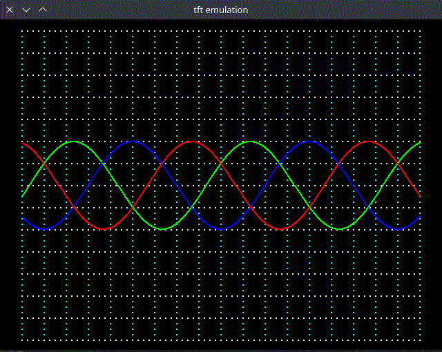

-  This is the TFT display emulation on the PC allowing pre-inspection.
-  Your code, no need reflashing of the microcontroller.
-  Multiple reflashing microcontroller forced to write such a thing.
-  It works only in NIX systems, as long as write Pixel is based on X11.
-  Can be rebuilt if someone will change write Pixel.

-  depends:
-  apt install -y freeglut3-dev
-  apt install -y libglfw3-dev
-  apt install -y libelf-dev

